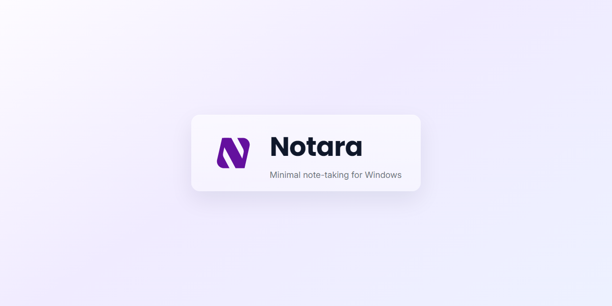

# Notara



Notara is a local-first notes app that gets out of your way. Your files live on your machine — no accounts, no sync services, no cloud. It's built with Electron and React, ships as a native desktop app, and stores everything as plain Markdown or text files you can open in anything.

## Features

- **Local-only storage** — notes, attachments, themes, and app state all stay on your machine
- **Markdown editing** — full WYSIWYG editor with heading, list, table, task list, link, and image support, plus a raw Markdown pane for when you want to see the source
- **Tags** — add tags per note via the tag bar, manage them globally from Settings, filter your note list by tag
- **Tabbed editing** — open as many notes as you want in tabs, drag to reorder, drag tabs between windows
- **Autosave and session restore** — your work is saved automatically and your open tabs come back on relaunch
- **Cross-note search** — full-text search across every note, backlinks panel, and knowledge graph view
- **Version history** — every note keeps a save history you can browse and restore from
- **Attachments** — import files, open them from the editor, verify integrity, or delete them
- **Multi-window** — move notes to their own window, or merge all windows back into one
- **Find and replace** — scoped to the current note or across all notes at once
- **Custom shortcuts** — remap any action from Settings → Keybindings; the app menu updates live
- **Themes** — built-in light and dark themes, with support for custom theme files

## Development

### Prerequisites

- Node.js 20+
- npm
- Windows, macOS, or Linux

### Getting started

```bash
npm install
npm run electron:dev   # start Electron app with hot reload
```

### Scripts

| Command                 | What it does                                          |
| ----------------------- | ----------------------------------------------------- |
| `npm run dev`           | Start the renderer dev server (browser)               |
| `npm run electron:dev`  | Start the full Electron app in dev mode               |
| `npm run typecheck`     | TypeScript check for the renderer                     |
| `npm run typecheck:all` | TypeScript check for renderer + Electron main         |
| `npm run lint`          | ESLint                                                |
| `npm run test:unit`     | Vitest unit tests                                     |
| `npm run build`         | Production build (renderer + Electron bundles)        |
| `npm run release:win`   | Build Windows installer and zip                       |
| `npm run smoke`         | Build and immediately launch the unpacked Windows app |

## Keyboard shortcuts

Default shortcuts are shown in the app under **Settings → Keybindings** and in the menu bar, which reflects any remapping you've done.

| Shortcut       | Action                   |
| -------------- | ------------------------ |
| `Ctrl+N`       | New note                 |
| `Ctrl+S`       | Save                     |
| `Ctrl+W`       | Close tab                |
| `Ctrl+F`       | Find                     |
| `Ctrl+H`       | Find & Replace           |
| `Ctrl+Shift+F` | Search all notes         |
| `Ctrl+P`       | Toggle raw Markdown pane |
| `Ctrl+\`       | Toggle sidebar           |

## Data locations

In development, data is stored in the project directory (`state.json`, `notes/`, `.user-data/`). In a packaged build, application data lives under the Electron `userData` path for your OS.

## Security

- The renderer has no access to Node.js APIs.
- `contextIsolation` is enabled.
- All file-system access goes through a typed preload bridge — the renderer can only call what's explicitly exposed.
- External link handling is restricted to HTTPS URLs in production.

## IPC reference

The full Electron bridge API is documented in `docs/ipc-api.md`.
